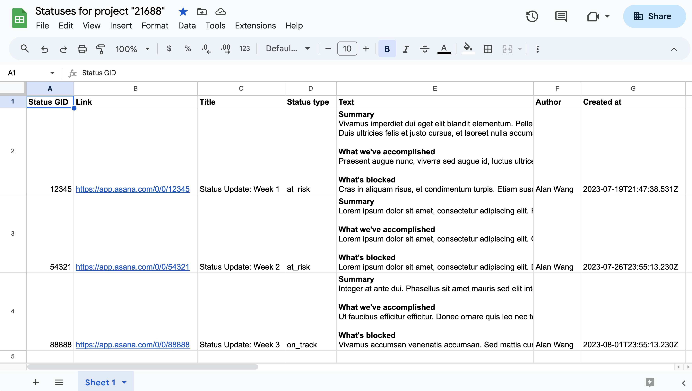

# Automate status reports with Google Apps Scripts
 
This application is automated reporting solution that reads status updates from a project, then appends them to a shareable spreadsheet.

## Requirements

Since the application largely makes use of out-of-the-box [Google Apps Scripts](https://script.google.com/home/start) features (e.g., [UrlFetchApp](https://developers.google.com/apps-script/reference/url-fetch/url-fetch-app), [SpreadsheetApp](https://developers.google.com/apps-script/reference/spreadsheet/spreadsheet-app)), there are no system requirements for this application.

Because the application is designed to run entirely in Google Apps Scripts, please ensure that you have the latest version of your preferred browser installed on your local machine.

## Usage

[View the documentation](https://developers.asana.com/docs/automate-project-status-reports-with-google-apps-scripts) for this application, which includes a step-by-step tutorial.

## Output

The standard information outputted in to the spreadsheet includes the following project metadata:

* Project ID (`current_status_update.gid`)
* Link (i.e., to the project)
* Status type (`current_status_update.status_type`)
* Text (`current_status_update.text`)
* Author (`current_status_update.created_by.name`)
* Created at (`current_status_update.created_at`)

To get information on a single project (including its current status update), you can request the complete project record by sending a request with its GID via the Asana API, as documented here: [GET /projects/{project_gid}](https://developers.asana.com/reference/getproject).

You can also see all status updates belonging to an object (e.g., a project) by making a request to (i.e., [GET /status_updates](https://developers.asana.com/reference/getstatusesforobject)). 

Additionally, visit the documentation for [input/output options](https://developers.asana.com/docs/inputoutput-options) for details on customizing API response.